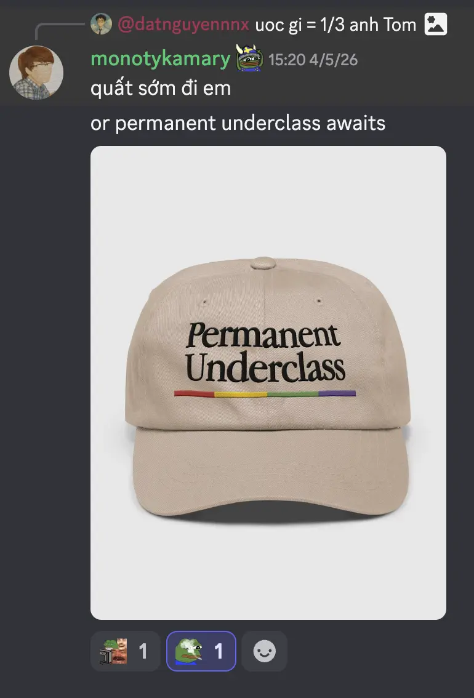
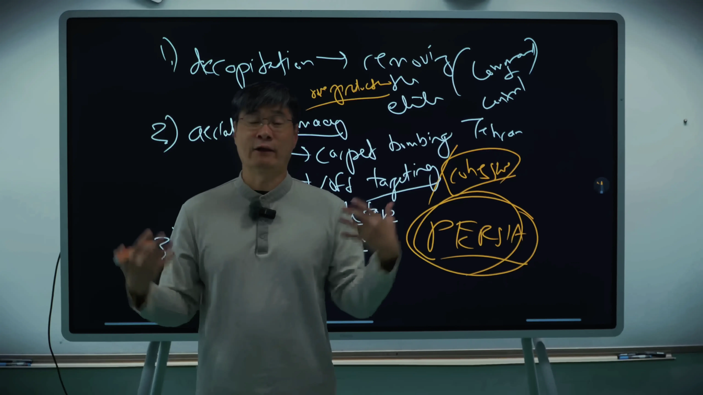

Everywhere I look today, I keep getting the same signal:

> **If you still don't know how to skillsmaxxing with LLMs and build personalized workflows/closed loops, the world will send you straight into the permanent underclass.**

The world changes every day, and we have to adapt.

Don't get me wrong. I'm not here to tell everyone to fomo into LLMs. To me, they're just another tool. If you don't know how to use them, you're already below the baseline for this generation.

The interesting part isn't the model itself. It's learning how to become the commander instead of the worker using AI to remove the boring manual work so you can spend more time thinking.

We've seen this story before.

The First Industrial Revolution replaced manual labor with machines. Then computers changed how people worked. Now it's AI and LLMs. Different technology, same pattern. Ignore it, and eventually you'll get left behind.

You can already see it happening. Layoffs are everywhere. Teams are getting smaller. Expectations keep getting higher.

Maybe it all comes down to two questions.

**Where do you wanna survive?**

And more importantly...

**What game are you actually playing?**

Because every game creates its own incentives. Every game rewards a different kind of person. Before you decide who you wanna become, maybe ask yourself whether you're playing the right game in the first place.

But there's another problem.

We're drowning in AI-generated content, endless brain dumps, and algorithm-fed brainrot. People consume way more than they think. I don't wanna become that person.

That's why this site exists.

It's my place to slow down, write down my own thoughts, connecting dots, and leave a trail of how I think. Maybe some posts will age badly. Maybe some won't. Doesn't matter. At least they're mine.

## So, who am I?

I started with a computer engineering background, mostly electronics and computer architecture.

Today, Im a software engineer working in finance industry.

## What will you find on this site?

Mostly things I genuinely spend my time thinking about:

- Software engineering.
- Finance - both crypto and trafi.
- Politics. Yah, it's a sensitive topic, but I'll still write about it from my own perspective.
- Mathematics. It's the foundation of the persona I'm trying to build; someone who thinks in models, probabilities, finance, and algorithmic trading.

## Why finance and politics?

Finance is where I've spent most of my career, so naturally it's where most of my perspectives come from.

One of my first CEOs didn't give me answers. He simply showed me that finance is a game with its own rules, incentives, and players. Everything after that was my own journey; trying to understand the game instead of just participating in it.

Vietnam in 2026 also gave me plenty of reasons to write.

Most of my perspective didn't come from reading news headlines.

It came from being in the room.

I was there when crypto exchanges collapsed. I watched founders argue over decisions that shaped entire companies. I saw startups grow, pivot, and die. I heard stories that never reached the public, and that's when I realized reality is always messier than the version people see online.

Those experiences shaped how I think, and this site is where I wanna document that thinking.

So yah, this is the first message I wanna leave here.

If you somehow found this page and still think writing your own thoughts is rare in 2026...

**Type W for fighting AI slop and surviving the brainrot era.**

**Tiếng nói của thế hệ / Every generation plays a different game. This is ours.**

**Insert MCK** - [Tây Thi](https://www.youtube.com/watch?v=s0JICY2omJY)